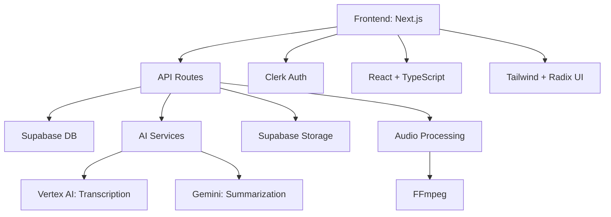

# Waivs.ai

Waivs.ai is an AI-powered platform for healthcare professionals to manage patients, generate session transcripts, and automate clinical documentation using advanced speech-to-text and generative AI technologies.

---

## Table of Contents
- [Waivs.ai](#waivsai)
  - [Table of Contents](#table-of-contents)
  - [Overview](#overview)
  - [Features](#features)
  - [Architecture](#architecture)
  - [Tech Stack](#tech-stack)
  - [Project Structure](#project-structure)
  - [Setup \& Getting Started](#setup--getting-started)
  - [Core Workflows](#core-workflows)
    - [Patient Session Flow](#patient-session-flow)
    - [API Route Example](#api-route-example)
  - [Security \& Compliance](#security--compliance)
  - [Contributing](#contributing)
  - [License](#license)

---

## Overview
Waivs.ai streamlines the process of clinical documentation by enabling doctors to record patient sessions, transcribe audio, and generate structured notes (e.g., SOAP) automatically. The platform integrates with Supabase for backend data management and leverages large language models for summarization and note generation.

## Features
- **Patient Management:** Add, edit, and track patients and their encounters.
- **Session Recording:** Record and upload patient session audio securely.
- **AI Transcription:** Convert speech to text using advanced models.
- **AI Note Generation:** Automatically generate clinical notes (e.g., SOAP) from transcripts.
- **Multi-language Support:** Internationalization and localization ready.
- **Role-Based Access:** Secure authentication and user management with Clerk.
- **Modern Dashboard:** Responsive UI for doctors to review, edit, and manage data.

## Architecture



- **Frontend:** Built with Next.js (React), using server and client components, context providers, and modular UI components.
- **Backend/API:** Next.js API routes handle audio processing, session management, and AI integration.
- **Database & Storage:** Supabase for relational data and file storage.
- **AI Services:** Integration with Google Vertex AI and Gemini for transcription and summarization.
- **Authentication:** Clerk for secure, role-based access.

## Tech Stack
- **Frontend:** Next.js 15, React 19, TypeScript, Tailwind CSS, Radix UI
- **Backend:** Next.js API routes, Supabase, Google Vertex AI, Gemini
- **Auth:** Clerk
- **Other:** FFmpeg, Tiptap, React Hot Toast, Framer Motion

## Project Structure
```
/waivs.ai
├── app/                    # Main app logic (pages, API, components)
│   ├── (dashboard)/        # Dashboard and authenticated routes
│   ├── (home)/             # Landing and marketing pages
│   ├── api/                # API routes (audio processing, session)
│   ├── components/         # UI components
│   ├── contexts/           # React context providers
│   └── ...
├── public/                 # Static assets
├── supabase/               # DB types, client, utils
├── gemini/                 # AI summary types and logic
├── hooks/                  # Custom React hooks
├── lib/                    # Utility functions
├── enums.ts                # App-wide enums
├── middleware.ts           # Next.js middleware
├── next.config.ts          # Next.js config
├── package.json            # Dependencies and scripts
└── ...
```

## Setup & Getting Started

1. **Clone the repository:**
   ```bash
   git clone https://github.com/anidamani/waivs.ai.git
   cd waivs.ai
   ```
2. **Install dependencies:**
   ```bash
   npm install
   # or yarn or pnpm
   ```
3. **Configure environment variables:**
   - Copy `.env.example` to `.env` and fill in required values (Supabase, Clerk, AI keys, etc).
4. **Run the development server:**
   ```bash
   npm run dev
   ```
5. **Open the app:**
   - Visit [http://localhost:3000](http://localhost:3000)

## Core Workflows

### Patient Session Flow
1. **Add Patient:** Use dashboard to add a new patient.
2. **Record Session:** Start a new session and record/upload audio.
3. **Process Session:** Audio is sent to `/api/process-session`, transcribed, and summarized by AI.
4. **Review Notes:** Generated notes and transcripts are available for review and editing.

### API Route Example
- `/api/process-session` handles audio upload, transcription, AI summarization, and database updates.

## Security & Compliance
- **Authentication:** All sensitive routes are protected by Clerk.
- **Data Storage:** Patient and session data stored securely in Supabase.
- **Compliance:** Designed with HIPAA/PHIPA best practices in mind (ensure cloud providers are compliant for production).

## Contributing
Pull requests and issues are welcome! Please open an issue to discuss any major changes or feature requests first.

## License
[MIT](LICENSE)

---

For questions or support, contact the maintainer or open an issue on GitHub.
